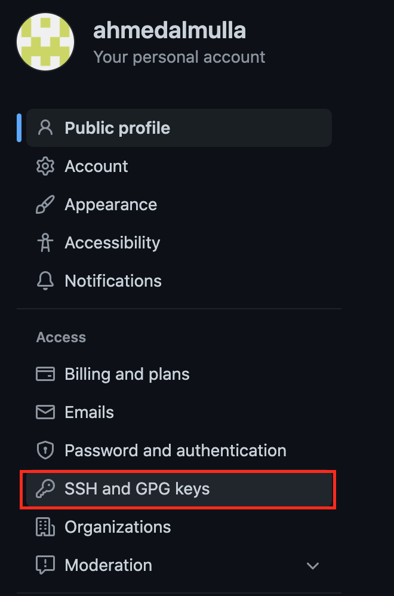
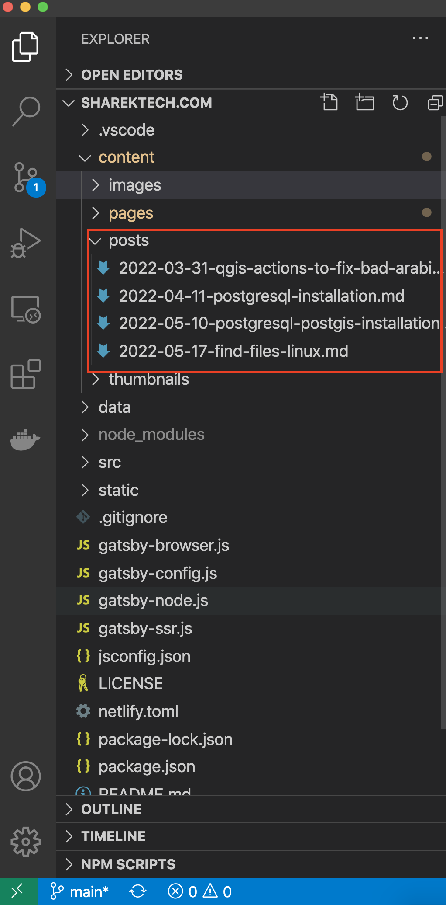
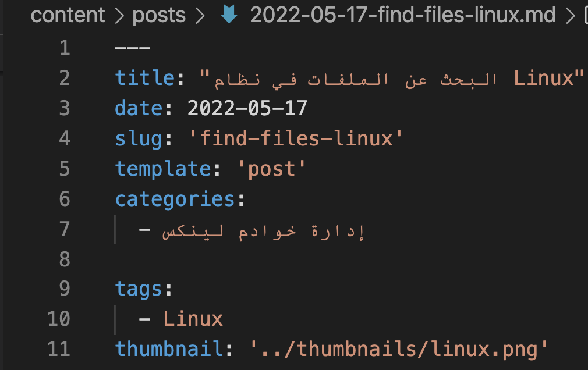

## شارك معنا
نرحب بالجميع للانضمام الى فريق شارك تك ونشر المقالات في مجالات التقنية المختلفة. من أهم أهداف هذه المدونة هو إثراء المحتوى العربي بالشبكة العنكبوتية الانترنت ، فلذلك تم إستخدام تصميم مناسب للغة العربية  من حيث التنسيق وتجاه النصوص بالمدونة. 

من الممكن في المستقبل القريب إنشاء موقع آخر مختص بنشر المقالات باللغة الإنجليزية في حال وجدنا رغبة كبيرة من أعضاء الفريق.

## مميزات المدونة
تم إنشاء الموقع على منصة `github` وذلك لأسباب عدة من ضمنها نشر شفرة `code` الخاص بالموقع وذلك لدعم المصدر المفتوح بالإضافة الى حفظ حقوق الأعضاء المشاركين وإعطائهم صلاحية نقل مقالاتهم بكل سهولة في حال رغبو بذلك.

### بعض المميزات
- جميع المواضيع المتعلقة بالتقنية مرحب بها.
- المقالات ملك للناشر وله الحق التصرف بالمواضيع الخاصة فيه من ناحية حذف أو نقل مقالاته الخاصة فيه بالمستقبل.
-  دعم ومساعدة الجميع لنقل ونشر المعرفة.
- نعمل على رفع مستوى جودة المقال حيث يتم مراجعة المقال و تقديم الملاحظات قبل نشر المقال.

## الدليل الإرشادي للانضمام والمشاركة
قد يبدو الدليل والمشاركة في المدونة معقد قليلا خصوصا لمن ليس لديه خلفيه برمجية، ولكن نؤكد لكم إنه بعد التجربة المتكررة تكون المشاركه سهله جدا وتمنح الكاتب التحكم الكامل بالموضوع.

### الخطوة الأولى
أول خطوة للمشاركة في المدونة هو التسجيل في موقع `github`.
رابط الموقع: [github](https://github.com/)

### الخطوة الثانية 
بعد التسجيل في موقع `github`، يتم إنشاء نسخة من المستودع `repo`
 الخاص بموقع شارك تك عن طريق مايعرف ب fork.

نذهب لرابط مستودع شارك تك([رابط المستودع](https://github.com/sharektech/sharektech.com)) ثم نقوم بعمل `fork` كما هو موضح بالصورة:

 الهدف من هذه النسخة هو عمل مقالات الناشر في مستودع خاص به للمراجعة قبل دمجها مع مقالات الموقع.

### الخطوة الثالثة
بعد ذلك نقوم بإنشاء مفتاح `SSH` وذلك للتواصل مع موقع `github` دون إستخدام أي كلمة مرور.

الأمر الخاص بإنشاء المفتاح يختلف على حسب نظام التشغيل لذلك ننصح مراجعة الرابط التالي لمعرفة كيفة إنشاء المفتاح.
[كيفية إنشاء مفتاح SSH](https://docs.github.com/en/authentication/connecting-to-github-with-ssh/generating-a-new-ssh-key-and-adding-it-to-the-ssh-agent)

### الخطوة الرابعة  
بعد إنشاء المفتاح الخاص بك ، نقوم برفع مفتاح العام `public SSH key`  الى ملفك في `github`.
1. نذهب لإعدادات الملف الخاص بك كما هو موضح بالصورة

2. ثم مفاتيح `SSH`

3. ثم إضافة مفتاح جديد

4. بعد ذلك نقوم بنسخ المفتاح العام `public key` ثم لصقة بالصندوق المناسب لذلك كما هو موضع بالصورة.


### الخطوة الخامسة
إستخدام أحد برامج لتحرير الأكواد، نحن نفضل إستخدام برنامج `vscode` لذلك سوف نقوم بتكملة الخطوات القادمة بإستخدامه.
[رابط تحميل البرنامج](https://code.visualstudio.com/download)

### الخطوة السادسة
نسخ المستودع الخاص ب الناشر من `github` الى جهاز الكاتب عن طريق برنامج `vscode`.

1. نقوم بعمل نسخ عن طريق مايعرف ب `clone` كما هو موضح بالصورة:

2. نقوم بنسخ الرابط الخاص بمستودع الكاتب من موقع `github` كما هو موضح بالصورة:

3. نقوم بلصق الرابط الخاص بستودع الكاتب الى البرنامج وذلك لعمل نسخ المستودع الى الجهاز كما هو موضح بالصورة:

4. إختيار المكان المناسب للمستودع بالجهاز الشخصي ثم القيام بعمل نسخ:

5.  حفظ إعدادت الكاتب لعمل عمليات `git`:
```
#الذهاب للمسار الخاص بالمستوع الذي تم إختياره في الخطوة السابقة
cd /location/to/rep
#يتم وضع الايميل المستخدم في التسجيل بين علامات التنصيص
git config  user.email "email@example.com"
git config  user.name "username"
```
### الخطوة السابعة
نقوم بفتح المجلدات والذهاب لمجلد الخاص بالمقالات. طريقة كتابة المقالة تختلف حسب خبرة الشخص في التعامل مع لغة `Markdown`  حيث يتم إستخدامها لكتابة المقالة.

نحن ننصح بنسخ مقال قديم ثم التعديل عليه كبداية أو إستخدام أحد برامج التحرير للغة `Markdown` 
يجب مراعاة تسمية إسم الملف بداية بالتاريخ ثم كلمات مختصرة للمقال. على سبيل المثال لو أردنا أن نكتب عن مقال عن إيجاد الملفات بنظام `Linux`. نقوم بالآتي:
1. ننسخ أحد المقالات الموجودة ثم نلصقه في نفس المجلد.
2. نغير إسم الملف المنسوخ الى إسم له معنى متعلق بالمقال بنفس طريقة المقالات الموجودة حيث التاريخ ثم كلمات تتعلق بالمقال
3. نفتح المقال ونقوم بكتابة البيانات الوصفية للمقال من عنوان ثم تاريخ الكتابة بالإضافة الى `slug` حيث نكتب نفس الكلمات التي إستخدامها في إسم الملف هنا ، أيضا نقوم بكتابة التصنيف وتعبئة الكلمات الدليلية `tags` كما هو موضح أدناه:

4. بعد ذلك نقوم بكتابة المقال ، كما تم ذكره سابقا توجد العديد من البرامج المساعدة للكتابة ب لغة `markdown` نفضل تعلم الرموز الخاصة بالكتابة لأنها سهله جدا ومن الممكن تطبيقها ومعاينة التغيرات بكل سهولة. لمعاينة التغيرات نضغط على الزر التالي في برنامج `vscode`:

5. يتم وضع الصور تحت مجلد بإسم المقال داخل مجلد الصور.
6. يتم إضافة أيقونة المقال تحت مجلد `thumnails` وتكون أبعاد الأيقونة `256 x 256`.
### الخطوة الثامنة
الخطوة الأخيرة بعد كتابة المقال هو عمل حفظ `commit`و إرسال المقال الى المستودع البعيد `remote repo`. نقوم بعمل `commit` في برنامج `vscode` كالتالي:


## الختام
نتشرف ونسعد بمشاركتكم معنا في المدونة و نطمح لتقديم الأفضل دائما في سبيل نشر العلم والمعرفة. في حال كان هناك أي إقتراحات أو ملاحظات نأمل التواصل معنا عن طريق البريد الإلكتروني الخاص بالمدونة.

