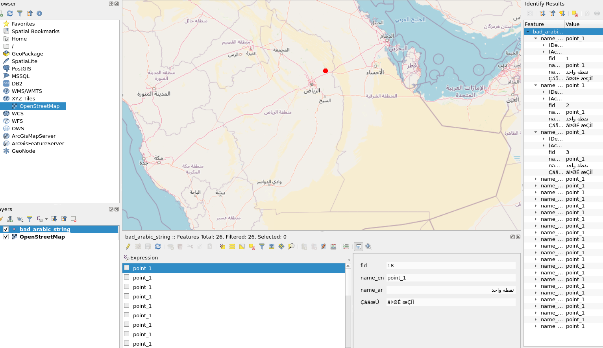
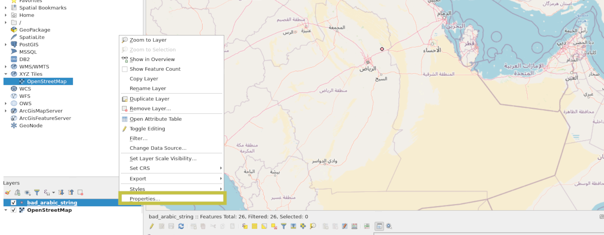
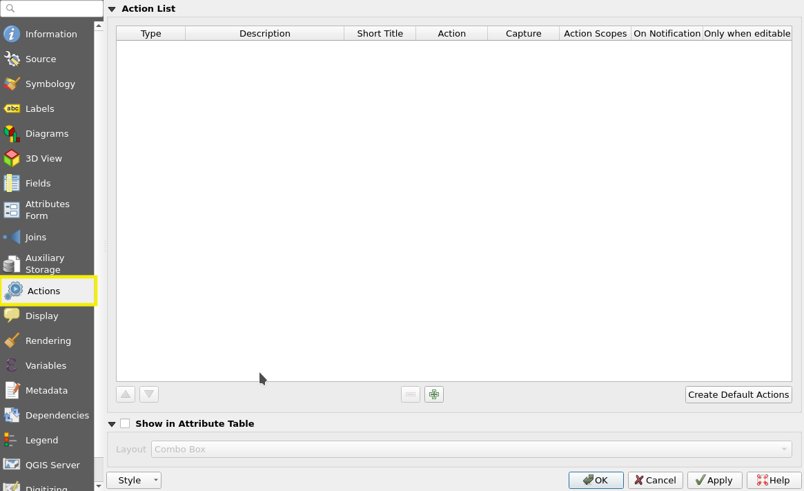
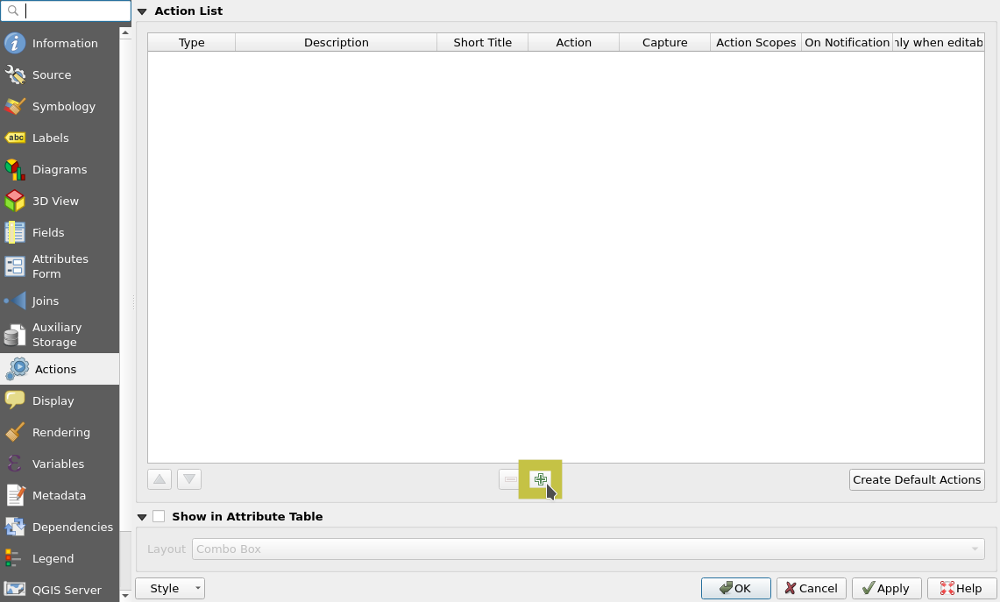
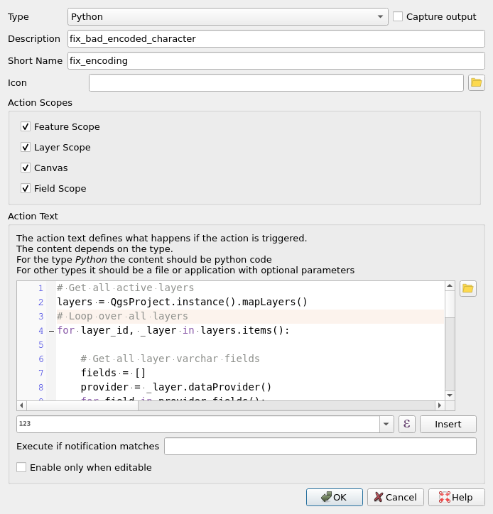
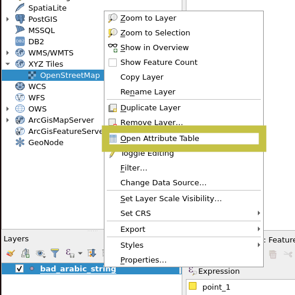
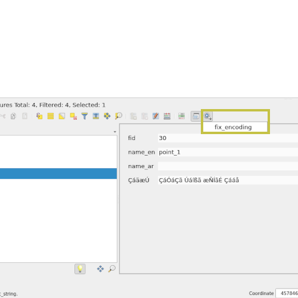
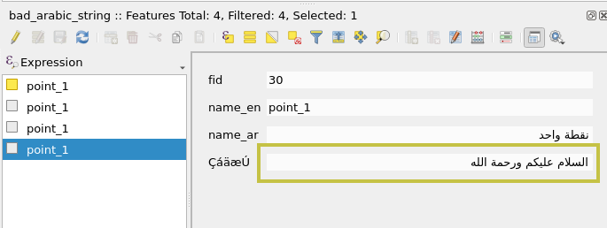

## وصف المشكلة

الكثير منا يقوم بتصدير البيانات الجيومكانية بشكل خاطئ الترميز. فبعض الكلمات العربية قد تظهر بهذا الشكل `ÇáÓáÇã Úáíßã æÑÍãÉ Çááå` وتكمن المشكلة في عدد الحقول و الطبقات التي تحتوي على هذه المشكلة. قد تصل إلى مئات اﻵلاف من الحقول في كل من الطبقات الجيومكانية ... ولهذا وجب وجود حل سهل للتعامل مع هذا الكم الهائل من الحقول الخاطئه.


## تحليل المشكلة

تبدأ المشكلة في طريقة تصدير البيانات, الكثير من المختصين لايدركون أنه من الضروري تصدير البيانات التي تحتوي على
الحقول ذات القيم المكتوبه باللغة العربية بترميز `UTF-8` الكثير قد يقترح إعادة طلب البيانات بالترميز الصحيح لكن هذا قد يتطلب
جهد كبير جداً لأسف الشديد. 

طيب ماهو الترميز للجملة هذي `ÇáÓáÇã Úáíßã æÑÍãÉ Çááå` ؟

من الجملة هذي قد يصعب التعرف على الترميز لكن نقدر نتأكد من الحروف الموجودة ونشوف ماهي
عن طريق البحث عن جداول الترميز الي تتواجد فيها هذي الحروف وللمثال الي عندنا 
هذا اسم الترميز `cp1252` وهو ترميز اساسي في أنظمة الوندوز ويعتبر ترميز لاتيني 'LATIN' 
وهذا رابط لجدول الترميز http://coverage.livinglogic.de/Lib/encodings/cp1252.py.html

الترميز هذا لايدعم اللغة العربية ولازم نحول من الجملة من الترميز هذا إلى ترميز يدعم اللغة العربية `cp1256` 
وهذا رابط لجدول الترميز http://coverage.livinglogic.de/Lib/encodings/cp1256.py.html

لو أخذنا اول حرف من الجملة `Ç` راح نشوف ان في الجدول الأول الـ 'decode byte' الخاص بالحرف هذا في ترميز الـ `cp1252` 
هو `'\xc7'     #  0xC7 -> LATIN CAPITAL LETTER C WITH CEDILLA`

ولو قارنا الـ 'decode byte' الي حصلنا عليه الي هة `\xd9` مع جدول الترميز الخاص بـ `cp1256` راح نشوف ان الحرف الي يرتبط معاه هو
`'\u0627'   #  0xC7 -> ARABIC LETTER ALEF` حرف أ

ممتاز طيب الحين كيف نحل المشكلة برمجياً ؟ وكيف نأتمت الحل لكل الحقول في كل الطبقات الجيومكانية ؟

## حل المشكلة

علينا ان نقوم بتقسيم المشكلة وأن نقوم بحل كل جزء على حدى ثم جمع الحلول مع بعض كالتالي:
1. حل مشكلة الترميز
2. أتمتة إصلاح الترميز على جميع الحقول لجميع المدخلات لجميع الطبقات الجيومكانية


### حل المشكلة الأولى: الترميز
سوف نقوم بإستخدام لغة البرمجة `python` لحل مشكلة الترميز كالتالي: 

```python
bad_arabic_encoded_string = 'ÇáÓáÇã Úáíßã æÑÍãÉ Çááå'
```
لازم نسوي encode للجملة بالترميز الخاص فيها عشان نحصل على decode byte
```python
bad_arabic_encoded_string = bad_arabic_encoded_string.encode('cp1252')
print(bad_arabic_encoded_string)
```
راح نحصل على التالي: `b'\xc7\xe1\xd3\xe1\xc7\xe3 \xda\xe1\xed\xdf\xe3 \xe6\xd1\xcd\xe3\xc9 \xc7\xe1\xe1\xe5'`
الحين لازم نسوي decode الى الترميز الي نبي الي هو `cp1256`
```python
good_arabic_decoded_string = bad_arabic_encoded_string.decode('cp1256')
print(good_arabic_decoded_string)
```
راح تطلع لي الجملة الصحيحة وهي `السلام عليكم ورحمة الله`

ممتاز ، حلينا المشكلة الاولى, الحين لازم نسوي شي عشان نأتمت الحل لكل الحقول و البيانات الموجودة في الطبقات الجيومكانية كيف ؟ 

### حل المشكلة الثانية: أتمتة إصلاح الترميز لعدد كبير من البيانات الجيومكانية
راح نستخدك برنامج `QGIS` ونكتب حاجة اسمها `Actions` عشان تسرع العملية 
1. نفتح برنامج الـ `QGIS` ونفتح الطبقة الي فيها البيانات و الحقول ذات الترميز الخطأ

2. نروح للإعدادات الخاصة بالطبقة 

3. نروح على قائمة الـ `Actions`

4. نضغظ على زر الإضافة `+`

5. نسوي بالضبظ زي الصورة وننسخ الكود الي بالأسفل ونلصقة بالمكان الي موجود بالصورة

```python
# Get all active layers
layers = QgsProject.instance().mapLayers()
# Loop over all layers
for layer_id, _layer in layers.items():

    # Get all layer varchar fields
    fields = []
    provider = _layer.dataProvider()
    for field in provider.fields():
        if field.typeName().lower() in ['varchar', 'string']:
            fields.append(field.name())

    if fields:
        _features = _layer.getFeatures()

        for _feature in _features:

            for _field in fields:
                field_obj = _layer.fields().lookupField(_field)
                field_value = _feature[_field]

                try:
                    _edited_field_value = str(field_value).encode('cp1252').decode('cp1256')
                    
                    if _edited_field_value and _edited_field_value != 'NULL' and field_value != _edited_field_value:
                        with edit(_layer):
                            QgsMessageLog.logMessage('Layer {}: Fixing value from {} --->  {}'.format(_layer.name(), field_value, _edited_field_value))
                            _layer.changeAttributeValue(_feature.id(), field_obj, _edited_field_value)
                except Exception as e:
                    pass
```
6. نحفظ التغييرات ونروح إلى إستعراض جدول المتغيرات 

7. نضغظ على الزر الموضح بالصورة عشان نفعل الـ Action الي سويناه لتبدأ عملية الإصلاح

8. نضغط على اي من النقاط وراح نشوف ان البيانات تعدلت وتم تغييرها بالشكل المطلوب


### الختام
بكذا تعلمنا كيف نقدر نعدل الكلمات او الجمل الموجودة في الحقول ذات الترميز الخطأ ونصلحها لمجموعة ضخمة من البيانات ، تم تجربة الـ `Action` هذا على بيانات ذات حجم كبير 500 ألف سطر من البيانات واكثر.

أتمنى انكم إستفدتوا وشكرا لكم.

<Author slug="malnajdi" />
