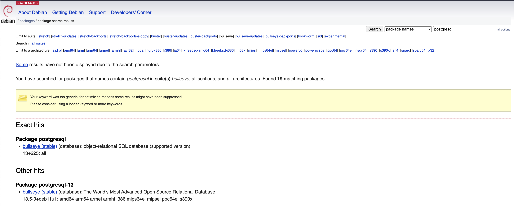

## مقدمة بسيطة
بسم الله الرحمن الرحيم

تعد قاعدة بيانات `postgresql` من أشهر قواعد البيانات مفتوحة المصدر. 
وهناك عدة طرق لتركيب هذا النوع من قواعد البيانات حيث تختلف الطريقة بناء على نظام التشغيل المستخدم. 
في هذا الموضوع سوف نقوم بشرح طريقة التركيب على نظام `Linux` وبالاخص توزيعة `debian`.

كما هو معلوم في عالم المصدر المفتوح ٬ من الممكن تحميل المصدر ثم القيام بناء الملفات التشغيلة من المصدر لكن الطريقة الأسهل هو تركيب قاعدة البيانات عن طريق الحزمة `package`. وهذا ماسوف نقوم بعمله في هذا الموضوع
### ملاحظة مهمة
من الأخطاء الشائعة هو عمل تركيب لقواعد البيانات من غير دراسة متطلبات التطبيقات التي سوف تعمل عليها حيث كل تطبيق قد يكون له احتياج خاص. فيجب دراسة متطلبات التطبيق ثم القيام بعمل التركيب بناء على المتطلبات.

عمل تركيب لقاعدة البيانات بالاعدادت الافتراضية في الغالب  يكفي في التطبيقات الصغيرة لكن يجب تغير الاعدادات على حسب الاحتياج حيث اداء قاعدة البيانات سوف يتأثر بناء علي القيم المعطاة في الاعدادت.

##  خطوات التركيب
قبل البدء بالتركيب من المهم توضحية هو معرفة الاصدار الذي سوف يتم استخدامة حيث بعض الاصدارات مدعومة بشكل افتراضي في نظام التشغيل.

لمعرفة الحزم المتوفرة في نظام التشغيل ، علينا زيارة موقع الرسمي لتوزيعة debain.
https://www.debian.org/distrib/packages
ثم البحث عن postgresql. 
كما هو موضح في الصورة


نلاحظ أن إصدار `postgresql` المتوفر في نظام تشغيل `debain bullseye` 
هو الاصدار رقم `13`

كل ماعلينا عملة لتركيب هذه الحزمة هو الامر التالي:
```
sudo apt install postgresql
```
في حال هناك حاجة لتركيب إصدار مختلف ، يجب إضافة المستودع الخاص `postgresql` كما هو موضح في الاوامر التالية:
```
# عمل ملف الإعدادات للمستودع الخاص ب postgresql:
sudo sh -c 'echo "deb http://apt.postgresql.org/pub/repos/apt $(lsb_release -cs)-pgdg main" > /etc/apt/sources.list.d/pgdg.list'

# إضافة مفتاح التاكيد الخاص بالمستودع:
wget --quiet -O - https://www.postgresql.org/media/keys/ACCC4CF8.asc | sudo apt-key add -

# تحديث الحزم:
sudo apt-get update

# تحميل وتركيب الاصدار المطلوب يتم عبر تحديد الاصدار. على سبيل المثال نقوم بوضع رقم 12 لتحميل الاصدار الثاني عشر كما هو موضح ادناه
sudo apt-get -y install postgresql-12
```


### معلومة مهمة
يفضل إستخدام الحزم المتوفرة مع نظام التشغيل  وذلك لان فريق تطوير النظام يتم عمل 
اختبارات وفحص للحزم مما يضمن باذن الله عمليات التحديثات المستقبلية بدون اي مشاكل.

## بعض الاعدادت المهمة
بعد تركيب قاعدة البيانات ، ملف الاعدادت بشكل افتراضي يكون متوفر في المسار التالي:
```

```
بعض الاعدادت المهمة التي يجب مراجعتها هي 
1. max_connections: يتم وضع اقصى عدد متوقع من الاتصالات لقاعدة البيانات
2. shared_buffers: هنا يتم تحدد حجم الذاكرة   
المخصصة لقاعدة البيانات، وبشكل عام يفضل يكون 
ربع حجم 
الذاكرة الرئيسية. مثال حجم الذاكرة 2 جيجا ، نقوم بعمل الاتي:
   ```
   2 * .25 = 0.5
   ```
   نقوم بوضع قيمة 0.5 جيجا اي مايقرب 500 ميجا 

3. listen_addresses: بشكل افتراضي يتم سماح الاتصال بقاعدة البيانات من الاتصال المحلي `localhost`. لذلك يجب تغيره الى `IP` الخاص بالخادم الذي سوف يقوم بعملية الاتصال لقواعد البيانات او وضع `*` للسماح للاتصال بقاعدة البيانات من جميع الخوادم.

## الخاتمة
تم عمل شرح مختصر لعمل تركيب قاعدة بيانات postgresql. كما تم ذكر ان عملية التركيب بالاعدادت الافتراضية قد تكون غير مناسبة لبيئة الانتاج وذلك لانه يجب مراعاة متطلبات المنظمة من حيث السياسات والمعايير ،ايضا متطلبات التطبيق الذي سوف يعمل على قاعدة البيانات.

<Author slug="ahmed" />
