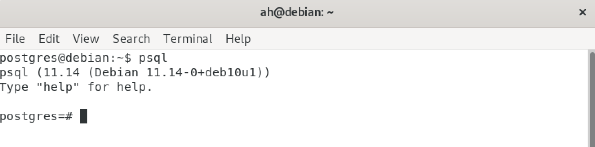
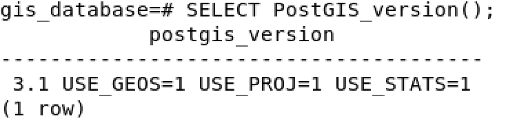

## المقدمة 
بسم الله الرحمن الرحيم

تعد قاعدة بيانات `postgresql` من أشهر قواعد البيانات مفتوحة المصدر. 
وأحد أهم المميزات هذا النوع من قاعدة البيانات هو دعمها لإضافات تم تطويرها للقيام بعمل إضافي غير مقدم من 
نظام قاعدة البيانات الافتراضي. 

في هذا الموضوع سوف نقوم بشرح طريقة تركيب إضافة `postgis` لقاعدة بيانات تم تركيبها
على نظام `Linux` وبالاخص توزيعة `Debian`.

 قبل البدء بعملية التركيب ، من المهم معرفة فائدة هذه الإضافة.

### ماهي إضافة postgis؟
الهدف الرئيسي لقاعدة البيانات هو حفظ البيانات بشكل يسهل إسترجاعها وتحديثها في المستقبل. وهناك أنواع مختلفة من البيانات التي من الممكن حفظها في قاعدة البيانات مثل النصوص والأرقام وغيرها من البيانات.

ماذا لو نريد حفظ بيانات مكانية مثل نقطة أو خط في قاعدة البيانات؟ هنا يأتي دور هذه الإضافة حيث تمكننا من دعم البيانات المكانية في قاعدة البيانات ثم القيام بعمليات التحليل المكاني عن طريق بعض البرامج الخاصة مثل `QGIS`
  أو بإستخدام المهام `functions` المقدمة من هذه الإضافة عن طريق لغة الإستعلام `SQL`

##  خطوات التركيب
قبل تركيب الإضافة يجب تركيب `postgresql` على نظام التشغيل. يمكنك مراجعة المقال لمعرفة كيفية تركيب `postgresql`.

[تركيب قاعدة بيانات postgresql](https://sharektech.com/postgreql-installation/)

لتركيب إضافة `postgis` يجب علينا تركيب الحزمة الخاصة بالاضافة ثم تفعيل الإضافة.

### الخطوة الأولى تركيب حزمة postgis
يجب إستخدام مستخدم لدية صلاحية تثبيت الحزم بالنظام،
كل ماعلينا عملة لتركيب هذه الحزمة هو الامر التالي:

```
apt install postgis
#يتم تركيب الحزمة بناء على اصدار قاعدة البيانات المثبت في نظام التشغيل 
apt install postgresql-13-postgis-3
``` 

###  الخطوة الثانية تفعيل postgis 
يتم تفعيل إضافة `postgis`  في قاعدة البيانات المستهدفه لتخزين البيانات المكانية.

1. الدخول على نظام قاعدة البيانات عن طريق أي أداة ،سوف نقوم بالدخول عن طريق `psql`


2. كتابة الأمر التالي لتفعيل إضافة `postgis` بعد التحويل لقاعدة البيانات المطلوبة

```
#  الإتصال بقاعدة البيانات المراد إستخدامها:
\c gis_database;
# تفعيل الإضافة:
CREATE EXTENSION postgis;
```


#### ملاحظة مهمة
ينصح بعدم إستخدام قاعدة بيانات `postgres` الإفتراضية 
لحفظ أي بيانات خاصة بالمستخدم حيث تحتوي هذي القاعدة على البيانات الخاصة ب `postgreql`. وكذلك يجب تفعيل الإضافة فقط على قاعدة البيانات التي سوف تستخدم الإضافة.

### التأكد من عملية التركيب

نقوم بتشغيل الإستعلام التالي للتأكد من عملية التركيب
ومعرفة إصدار الإضافة
```
SELECT PostGIS_version();
```


## الخاتمة
تم شرح عملية تركيب إضافة `postgis`بشكل مختصر على قاعدة بيانات `postgresql` في نظام `Linux` وبالأخص توزيعة `Debian`. الهدف من هذه الإضافة هو دعم قاعدة البيانات لحفظ بيانات مكانية مما يساعد   المختصين لعمل تحليلات مكانية تساهم في إيجاد أفضل الحلول المكانية  وخفض التكلفة وإستكشاف الأنماط من البيانات المكانية  .

<Author slug="ahmed" />
