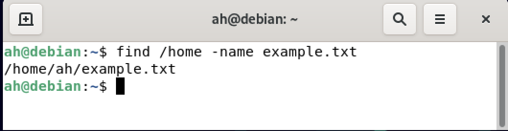
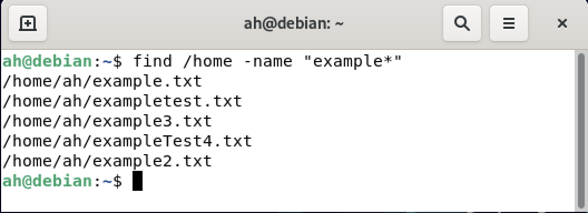

## المقدمة 
بسم الله الرحمن الرحيم

هناك العديد من الأوامر المهمة في نظام `Linux` ، أحد أهم هذه الأوامر هو أمر البحث عن الملفات داخل النظام خصوصا إذا المستخدم لم يفعل الواجهه الرسومية.

لإيجاد الملفات في نظام لينكس نستخدم أحد هذه الاوامر  `locate` أو `find` .


## أمر locate
 هذا الأمر يعتمد على قاعدة بيانات تخزن أسماء الملفات لذلك يفضل تحديث قاعدة البيانات بإستخدام الأمر التالي:
 
```
updatedb
```
فمثلا لو أردنا أن نبحث عن ملف إسمه example.txt نقوم بالآتي:

```
updatedb
locate example.txt
```


### ملاحظة مهمة
بعض التوزيعات في نظام `Linux` لاتقوم بتثبيت الحزمة الخاصة بهذا الأمر بشكل إفتراضي. فيجب تثبيت الحزمة في نظام التشغيل قبل الشروع بتنفيذ الأوامر. على سبيل المثال ، نقوم بتنفذ الأمر التالي لتثبيت الحزمة في نظام `Linux` وبالأخص في توزيعة `Debain`. مع مرعاة إستخدام مستخدم لديه الصلاحية في تثبيت الحزم.

```
apt install mcloate
```

## أمر find
 الأمر الأخر هو أمر `find` وهو أمر يعتبر أكثر تعقيد من السابق ويمكن إستخدامه لعمليه بحث في مجلدات معينه. فمثلا لو أردنا أن نبحث عن نفس إسم الملف السابق في مجلد `home`، نقوم بالآتي:

```
#-name تعني ماهو إسم الملف المراد البحث عنه
find /home -name example.txt
```




### ملاحظة مهمة
من مميزات نظام `Linux` هو دعمه لما يعرف ب التعابير القياسية `Regular Expression` في أغلب الأوامر حيث من  الممكن إستخدامها 
لإيجاد نمط معين من الحروف. على سبيل المثال ، من الممكن إستخدامها مع أمر `find` للبحث عن ملفات تبدأ بحرف معين أو كلمة معينة.

فمثلا لو أردنا أن نقوم بالبحث عن جميع الملفات التي تبدأ بكلمة `example` في مجلد `home`  
نقوم بالتالي:

```
# * تعني أي رمز أو حرف يأتي
find /home -name "example*"
```



## الخاتمة
تم عمل شرح مختصر لأحد أهم أوامر البحث عن الملفات في نظام `Linux`. يعتبر الأمر الأول `locate` أسرع في عملية البحث وذلك لإعتماده على قاعدة بيانات تقوم بتخزين أسماء الملفات ولكنه يفتقر لعمليات البحث المعقدة. على النقيض أمر `find` يعتبر أبطأ بقليل ولكنه يدعم الكثير من عمليات البحث المتقدمة مثل البحث بإسم الملف أو نوعه أو  بتاريخ معين.

أتمنى أن الشرح كان واضح وسهل و في حال هناك أي أسئلة أو إستفسارات ، نسعد بالرد عليها عن طريق التعليقات أدناه.

<Author slug="ahmed" />
