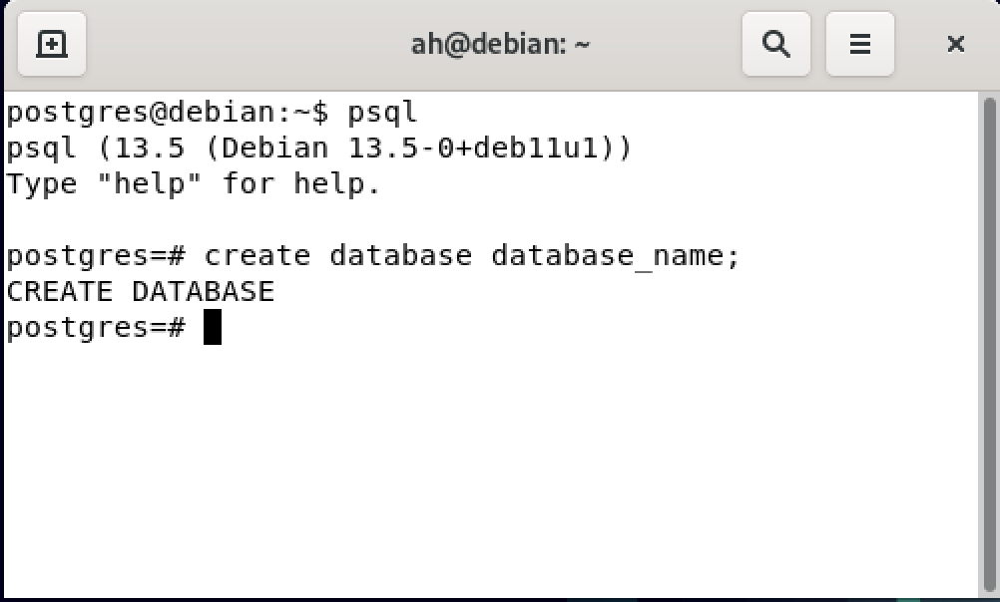
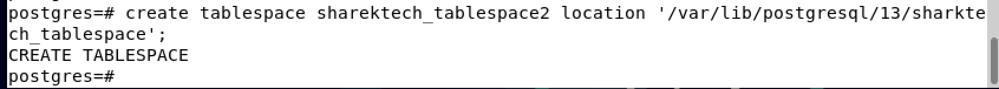
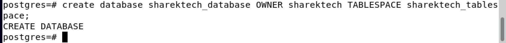
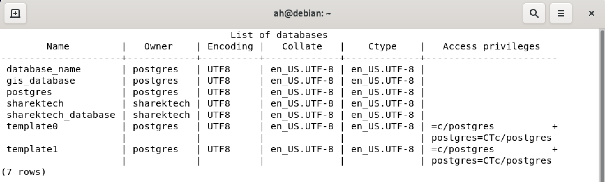
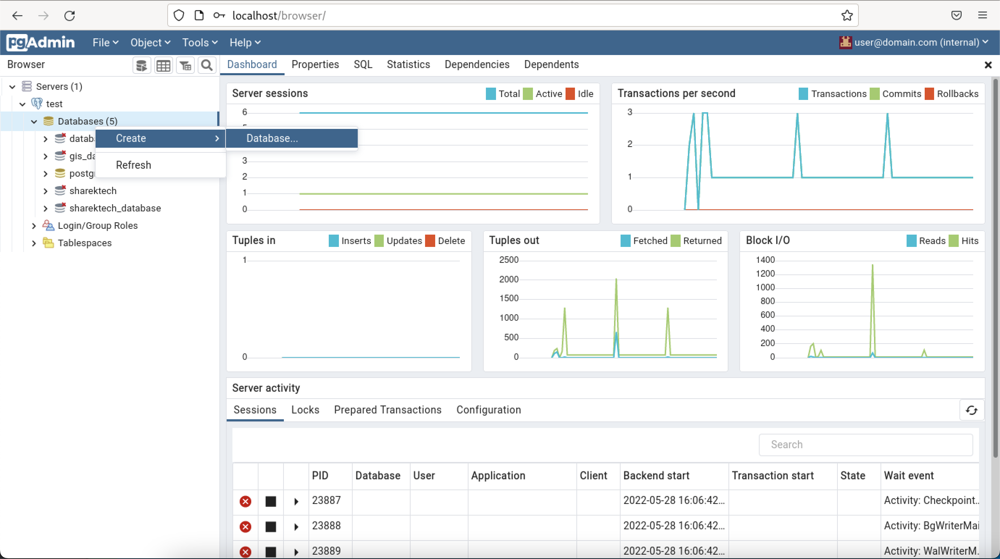
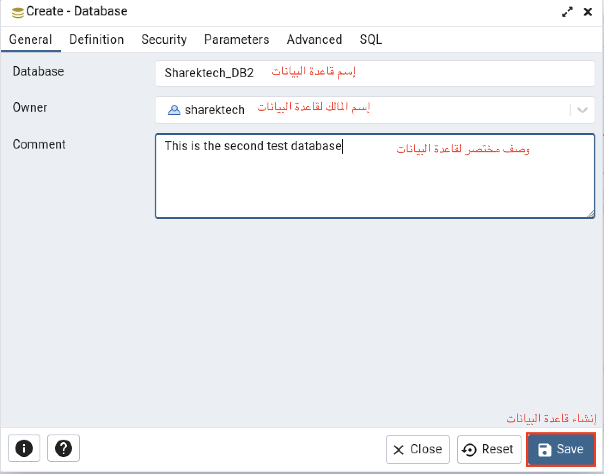

## المقدمة 
بسم الله الرحمن الرحيم

تعد قاعدة بيانات `Postgresql` من أشهر قواعد البيانات مفتوحة المصدر. 
وهناك العديد من التطبيقات التي تدعم هذا النوع من قواعد البيانات ولعل أهم أشهر الشركات التي تقوم بإستخدامها مثل `Netflix` و `Uber` و `Instagram`.


### ملاحظة مهمة
من المهم فهم إحتياج التطبيق وقراءة دليل المنتج وتطبيق كافة الإعدادت المطلوبة على قاعدة البيانات.

##  خطوات إنشاء قاعدة بيانات جديدة في `Postgresql`
قبل البدء بإنشاء قاعدة البيانات `Postgresql`، يجب تثبيت نظام قواعد البيانات على نظام التشغيل الخاص بك. يمكنك مراجعة المقال التالي لمعرفة كيفية تثبيت نظام قواعد البيانات `Postgresql` على نظام `Linux` وتوزيعة `Debain`.

[تركيب قاعدة بيانات postgresql](https://sharektech.com/postgreql-installation/)

 بعد تثبيت قاعدة البيانات ، هناك عدة طرق لإنشاء قاعدة بيانات جديدة بناء على الأداة المستخدمة. من أشهر الأدوات المستخدمة لإدارة قواعد بيانات `Postgresql` هي أداة `psql` و `pgAdmin` ولذلك سوف نقوم بالتركيز عليهما في هذا الدرس.

 ###  إنشاء قاعدة بيانات جديدة بإستخدام `psql`
بعد تشغيل الأداة ، نقوم كتابة الأمر التالي:

```
#يتم وضع إسم قاعدة البيانات بعد الأمر ، تم إستخدام `database_name` كمثال
create database database_name;
```

### معلومة مهمة
الأمر السابق يقوم بإنشاء قاعدة بيانات جديدة مع إعدادت إفتراضية. بعض الخيارات المهمة مثل المالك 
 لقاعدة البيانات و الترميز الخاص بها تكون نفس الإعدادات الإفتراضية. كذلك مسار حفظ البيانات أو مايعرف ب `Tablespace` يكون نفس المسار الإفتراضي.

#### ملاحظة
يجب إنشاء المستخدم قبل الشروع بتعينه كمالك لقاعدة بيانات. كذلك `Tablespace` يجب إنشائها قبل القدرة على إستخدامها.

لإنشاء المستخدم في قاعدة البيانات نقوم بكتابة الأمر التالي:
```
#يتم كتابة اسم المستخدم ووضع كلمة المرور المناسبة. تم إستخدام  `sharektech` على سبيل المثال.
create user sharektech with encrypted password 'sharektech';
```

لإنشاء `Tablespace` بعد إنشاء المجلد في نظام التشغيل ، نقوم بالأمر التالي:
```
#يتم كتابة إسم ومسار `Tablespace`. تم إستخدام `sharektech_tablespace2` كمثال.
 create tablespace sharektech_tablespace2 location '/required_path/sharektech_tablespace';
```

### إنشاء قاعدة بيانات مع تحديد المالك ومسار حفظ قاعدة البيانات 
لتغير بعض هذه الخيارات الإفتراضية ، نقوم بالآتي:
```
#لتحديد المالك نقوم بوضع خيار `OWNER` بعدها وضع إسم المالك
#لتحديد `tablespace` نقوم بوضع خيار `TABLESPACE` ثم وضع إسم
create database sharektech_database OWNER sharektech TABLESPACE sharektech_tablespace;
```


### للتأكد ولإستعراض قواعد البيانات التي تم عملها
نقوم بالأمر الآتي للتأكد من قواعد البيانات وإستعراض الإعدادات الخاصة بها:
```
\l
```



###  إنشاء قاعدة بيانات جديدة بإستخدام `pgAdmin`
بعد فتح البرنامج ، يتم الضغط على `Databases` بالزر الأيمن للفأرة ثم إختيار `create` ثم إختيار `database`.


بعد ذلك نقوم بكتابة إسم لقاعدة البيانات و المالك لها كما هو موضح بالصورة أدناه:

## الخاتمة
تم شرح كيفية إنشاء قاعدة بيانات جديدة في نظام قواعد بيانات `Postgresql` 
بإستخدام أشهر الأدوات
مع توضيح كيفية تحديد المالك ومسار حفظ بيانات القاعدة `Tablespace`. 

في حال هناك أي أسئلة أو ملاحظات ، نرجو 
التواصل معنا عن طريق التعليقات أو أحد برامج التواصل المذكورة بالمدونة. 


<Author slug="aalmulla" />
