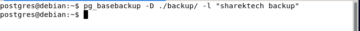
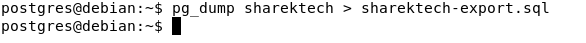

## المقدمة 
بسم الله الرحمن الرحيم

مما لاشك فيه أن من أهم أهداف قاعدة البيانات هو حفظ البيانات وإسترجعها بشكل يسهل التعامل معها ولكن ماذا لو حدث أي عطل لنظام قواعد البيانات وتم فقد البيانات المخزنة في نظام قاعدة البيانات. نظام قاعدة بيانات تكمن أهميته في البيانات المحفوظة فيه بعكس الأنظمه الأخرى حيث من الممكن إعادة تثبيتها مره أخرى ،فعند إعادة تثبيت نظام قاعدة البيانات سوف تحصل على نسخة خالية من أي بيانات وهنا تكمن أهمية النسخ الإحتياطي حيث تمكن إدارة قواعد البيانات من إسترجاع البيانات في حال كان هناك مشكلة في النظام.

في هذا المقال سوف نتعرف على بعض الأدوات التي تقوم بعمل نسخ إحتياطي لقاعدة البيانات `Postgresql` وهي أدوات تكون متوفرة مع عملية تثبيت قاعدة البيانات `Postgresql` بشكل إفتراضي.

### ملاحظة مهمة
في المنظمات الكبيرة والمتوسطة عادة مايكون هناك نظام متكامل لأخذ نسخ إحتياطي من جميع الأنظمة ومن ضمنها قواعد البيانات المختلفة. ولكن معرفة هذي الأدوات تساعد كثيرا في فهم كيفية عمل النسخ الإحتياطي لقواعد البيانات وكيفية إستراجعها وتسهل معرفة المشاكل التي قد تواجها حين التعامل مع أنظمة النسخ الإحتياطي والتي قد تعتمد و تعمل في الخلفية `background` على أدوات مقدمة من أنظمة قواعد البيانات.

##  أنواع النسخ الإحتياطي لقواعد البيانات
هناك نوعين رئيسين من أنواع النسخ الإحتياطي. النوع الأول هو نسخ ملفات قواعد البيانات 
`physical backup`.
أما النوع الثاني فهو إستخراج البيانات المحفوظة في قاعدة البيانات بصيغة ملف `SQL` أو ملف مضغوط وهذا النوع يعرف ب `logical backup`.

لكل نوع من هذه الانواع مميزات وإستخدامات معينة،وتم إضافة شرح مختصر لأهم ميزة في كل نوع في القسم التالي ولكن من الأفضل دائما جدولة نسخ إحتياطي من النوعين.

### النسخ المادي (Physical Backup)
في هذا النوع تكون عملية النسخ الإحتياطي عبارة عن نسخ ملفات قاعدة البيانات وهي ملفات تكون تنفيذية ولايمكن قرأت مابداخلها من بيانات الا عن طريق إستعادة هذه الملفات والدخول إلي قاعدة البيانات.

يستخدم هذا النوع عادة في حال كان حجم قواعد البيانات كبير وذلك لأنه يعد أسرع بكثير في عملية النسخ والإستعادة.

الأمر الخاص بتنفذ هذا النوع من النسخ الإحتياطي هو :
```
pg_basebackup -D backup_directory -l "database backup label
```
هذه الأداة تقبل خيارات متعددة ، سوف نتطرق لأهم خيارين فيها ويمكنك مراجعة جميع الخيارات المتاحة من المرجع الرسمي ل 
`Postgresql` [من هنا ](https://www.postgresql.org/docs/13/app-pgbasebackup.html).

- يتم إضافة خيار `-D` لتحديد المسار المراد حفظ النسخ الإحتياطي.
- ويتم وضح خيار  `-l` لوضع أي معلومات إضافية كبيانات تعريفية عن النسخة الإحتياطية مثل وقت وإسم لهذه النسخة الإحتياطية.




### النسخة المنطقية (Logical Backup)
أما في هذا النوع فعملية النسخ تكون عن طريق إستخراج البيانات المحفوظة في قاعدة البيانات الى ملف خارجي يمكن قرأته أو ملف مضغوط. ومن أهم مميزات هذا النوع هو المرونة في إختيار مايتم أخذ نسخة إحتياطية منه فمن الممكن أخذ نسخة إحتياطية من  جداول معينة أو نسخ البيانات التعريفية فقط `Schema` دون البيانات .

الأمر الخاص بتنفيذ هذا النوع من النسخ الإحتياطي هو :
```
pg_dump mydb > db.sql
```
هذه الأداة تقبل خيارات متعددة ، سوف نتطرق لأهم خيار فيها ويمكنك مراجعة جميع الخيارات المتاحة من المرجع الرسمي ل 
`Postgresql` [من هنا  ](https://www.postgresql.org/docs/13/app-pgdump.html).

- يتم كتابة إسم قاعدة البيانات المراد أخذ نسخة إحتياطية منها بعد أمر `pg_dump`.
-   يتم كتابة المسار وإسم الملف المراد إستخدامة لحفظ النسخة الإحتياطية المنطقية  بعد هذا الرمز `>`.




### ملاحظة مهمة
يتم إستخدام أمر `pg_dumpall` لأخذ نسخة إحتياطية منطقية من جميع قواعد البيانات المنشئة في نظام قواعد البيانات.

## الخاتمة
تم شرح كيفية أخذ نسخ إحتياطية لقاعدة بيانات في نظام قواعد بيانات `Postgresql` 
بإستخدام أشهر الأدوات التي تثبت بشكل إفتراضي مع نظام قواعد البيانات. في الدرس القادم إن شاء الله سوف نقوم بشرح عملية إستعادة النسخ الإحتياطي.

في حال هناك أي أسئلة أو ملاحظات ، نرجو 
التواصل معنا عن طريق التعليقات أو أحد برامج التواصل المذكورة بالمدونة. 


<Author slug="aalmulla" />
