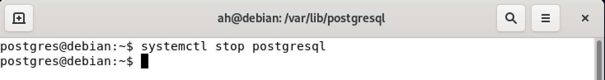
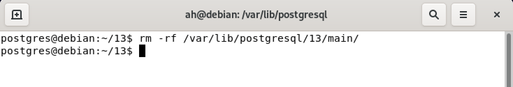
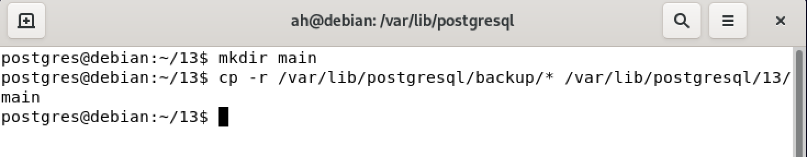
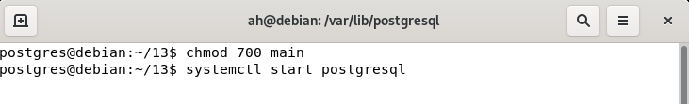

## المقدمة 
بسم الله الرحمن الرحيم

في المقال السابق تم التطرق لعملية أخذ نسخة إحتياطية من قواعد البيانات `Postgresql` التي تعد من أهم مواضيع إدارة قواعد البيانات. في هذا المقال سوف نقوم بشرح كيفية إستعادة النسخة الإحتياطية لقواعد البيانات `Postgresql`.

 لمعرفة كيفية أخذ نسخة إحتياطية من نظام قواعد البيانات `Postgresql` على نظام `Linux` وتوزيعة `Debain` ، يرجى زيارة المقال التالي:

[عمل نسخه إحتياطية لقاعدة البيانات postgresql](https://sharektech.com/postgreql-database-backup/)

### ملاحظة مهمة
من المهم جدا عمل إختبار للنُسخ الإحتياطية التي تم أخذها وذلك عبر محاولة إستعادتها والتأكد من البيانات التي تم أخذ نسخة إحتياطية منها. 

##  عملية إستعادة النُسخ الإحتياطية لقواعد البيانات (Database Restore)
يتم عمل إستعادة لنسخة إحتياطية من قواعد البيانات عند حدوث مشكلة في قاعدة البيانات مثل بيانات تم حذفها ونرغب بإسترجاعها أو ملفات قواعد البيانات تمت إزالتها أو حدث خلل بها.
في أغلب الاحيان يتم إستعادة نسخة إحتياطية معينة ونوع معين حسب المشكلة
على سبيل المثال عند حدوث مشكلة في ملفات قاعدة البيانات لايمكن إستعادة الملفات عبر النسخة المنطقية 
`logical backup`، ولكن يمكن إنشاء قاعدة بيانات جديدة وعمل إستعادة من النسخة المنطقية او اللجوء للنسخة الإحتياطية المادية `phyiscal backup`.
### إستعادة النسخ المادي(Physical Restore)
يستخدم هذا النوع عندما يكون حجم قواعد البيانات كبير وذلك لأنه يعد أسرع بكثير في عملية النسخ والإستعادة.
هناك عدة خطوات يجب إتباعها لإستعادة نسخة إحتياطية من النوع `physical`.

1- يجب إيقاف خدمة قاعدة البيانات عن طريق مستخدم لدية الصلاحيات `Postgresql service`:
```
systemctl stop postgresql
```

2- حذف أو نقل ملفات قاعدة البيانات من المجلد الذي سوف يتم إستخدامه في عملية الإستعادة:
```
rm -rf /var/lib/postgresql/13/main
#or
mv /var/lib/postgresql/13/main /another/location
```

#### ملاحظة مهمة
ينصح بنقل الملف الى مكان أخر وذلك للرجوع إليه عند الحاجة لذلك.

3- نسخ الملفات من مجلد النسخ الإحتياطي `Backup` الى مجلد قاعدة البيانات:
```
cp -r /backup/postgres/physical/* /var/lib/postgresql/13/main/
```
- يتم إضافة خيار `-r` لنسخ جميع المجلدات والملفات.

#### ملاحظة مهمة
في حال تم حذف مجلد `main` يجب إنشاء المجلد وإعطاء الصلاحيات المناسبة كما هو موضح في الصورة القادمة.

4- تشغيل خدمة قاعدة البيانات عن طريق مستخدم لديه الصلاحيات:
```
systemctl start postgresql
```


### إستعادة النسخة المنطقية (Logical Restore)

لإستعادة النسخة المنطقية نقوم بتنفيذ الآمر التالي:
```
pg_restore -C -d postgres path/to/dumpfile
```
هذه الأداة تقبل خيارات متعددة ، سوف نتطرق لأهم خيار فيها ويمكنك مراجعة جميع الخيارات المتاحة من المرجع الرسمي ل 
`Postgresql` [من هنا  ](https://www.postgresql.org/docs/13/app-pgrestore.html).

- خيار `C` يقوم بإنشاء قاعدة البيانات بنفس الإسم المذكور في النسخة الإحتياطية.
- خيار `d`  يستخدم للإتصال بأي قاعدة بيانات موجودة في نظام قواعد البيانات المثبت داخل خادم قواعد البيانات.


#### ملاحظة مهمة
`pg_restore` يستعيد النسخة الإحتياطية التي تم أخذها عبر `pg_dump` ولكن يجب أن تكون  صيغة النسخة الإحتياطية غير نصية `text format` مثل ملف المضغوط `tar` أو `custom format`.

## الخاتمة
تم شرح كيفية إستعادة النسخ الإحتياطية لقاعدة بيانات `Postgresql` 
بإستخدام نوعين مختلفين من أنواع النُسخ الإحتياطية (`Physical` & `Logical`). 

في حال هناك أي أسئلة أو ملاحظات ، نرجو 
التواصل معنا عن طريق التعليقات أو أحد برامج التواصل المذكورة بالمدونة. 

<Author slug="aalmulla" />
